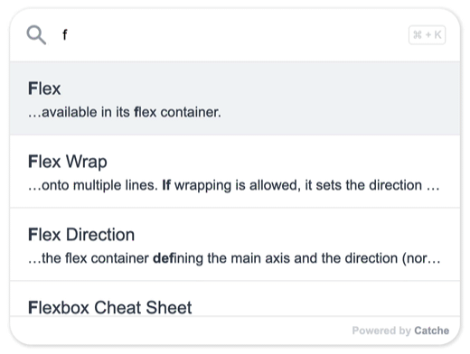

# Catche Search Widget

*AKA a [Ctrl/Cmd-K Menu](https://uiw.tf/cmdk) or a [Command Palette](https://tailwindui.com/components/application-ui/navigation/command-palettes)*

<p align="center">
  
</p>

**[Catche](https://try.catche.co/) provides a low-code way to add instant search to your website in two steps!**

1. Go to https://try.catche.co and enter your website URL
2. Add the provided code snippet to your website's `<head>`

---

This repo contains the open-source code for the client-side widget.

For those who are interested in theming their widget or using self-hosted data, check out the Tutorials section below.

Contributions welcome!

## Overview

This widget is built with Vue and TypeScript and uses Tailwind for styling.

Catche uses Supabase for our database hosting but you don't need to do that if you intend to self-host your data - you just need a JSON file!

We use [MiniSearch](https://github.com/lucaong/minisearch) for searching, while [fast-fuzzy](https://github.com/EthanRutherford/fast-fuzzy) is used for highlighting.

## Tutorials

Note - the `index.html` files in the tutorial folders cannot be opened as-is, due to several requirements in the scripts. Instead, run a local server via Node or Python.

### Themes

See [tutorials/theme](https://github.com/CatcheSearch/catche-search-widget/tree/main/tutorials/theme) for relevant files.

You can theme the widget via the `catche-css` attribute in the `<script>` element, which should take the path to the .css file.

```HTML
<script catche-css="PATH/TO/CSS" type="module" crossorigin src="PATH/TO/WIDGET/index.js"></script>
```

See [tutorials/theme/dark.css](https://github.com/CatcheSearch/catche-search-widget/blob/main/tutorials/theme/dark.css) for an example of the relevant CSS attributes.

### Custom Data

See [tutorials/selfhost](https://github.com/CatcheSearch/catche-search-widget/tree/main/tutorials/selfhost) for relevant files.

You can use your own data saved in a .json file, via the `catche-data` attribute in the `<script>` element, which should take the path to the .json file.

```HTML
<script catche-data="PATH/TO/JSON" type="module" crossorigin src="PATH/TO/WIDGET/index.js"></script>
```

The .json file should contain an array of objects, where each object represents a webpage with the following attributes:

- `id` - unique string
- `url` - URL of webpage
- `title` - title of webpage
- `text` - text of webpage

The widget will search through the `title` and `text` attributes.

See [tutorials/selfhost/my-data.json](https://github.com/CatcheSearch/catche-search-widget/blob/main/tutorials/selfhost/my-data.json) for an example of the data format.

